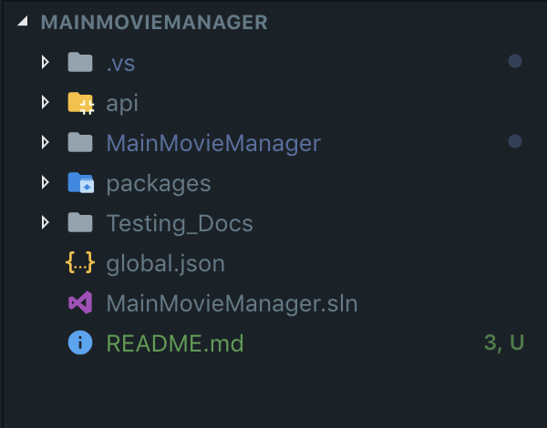

# Welcome to the Movie Manager App

## Application Contents

1. API Folder
2. MainMovieManager Folder

### API Folder

This folder holds all the content to run your API. For the MainMovieManager to work the API must be running before you **START / USE** the GUI application.

### MainMovieManager

This folder holds the GUI application. In the GUI application you sign in, search certain movies and add and remove selected movies to your wishlist. You can also update your details (not your Username) within the app.

## Getting Started

The GUI Application is a Cocoa App for macOS. The app use's Visual Studio for Mac and XCode.

**NOTE: You don't need XCode to run the app**

### Setting up API

Open up VSCode. If on mac go ```command + spacebar``` which opens up spotlight and search for VSCode and press enter. If on windows DIY (DO - IT - YOURSELF).

Once VSCode has opened locate the root folder of the application. Probably will be on your desktop, but will be in the location you cloned this application. (For me the Root folder name is MainMovieManager, but will be the Repositories name).

#### You should have a folder structure like this or very similar:



VSCode will only be used for running the API as I have built it in .Net Core and not the GUI application.

Once your in VSCode open up the api folder (by ```clicking```), than open up the sql folder (by ``` clicking ```) than click on ```data.sql```, and that file should open up.

Now if you don't have your MSSQL Connection string up, I recommend this resource for seeting up you enviroment. <a href="https://docs.jwk.nz/dotnet_core/sqlsvr_webapi/dotnet-2.1.x/01-project-setup/">API Project Setup</a> just follows this guide and your enviroment will be setup.

Once you have your connection setup, and have the ``` data.sql ``` file open right click (Windows) or two fingers down (macOS) on the open file and select execute query, and select you connection. 

In VSCode and the Root Folder open up the intergrated terminal but going ``` control ` ``` than type ``` cd api ``` press enter, than type ``` dotnet run ```. Now the API is running.

## Setup GUI Application

Open up Visual Studio for Mac ``` command + spacebar ``` and searcg Visual Studio and press enter, on Windows oh wait, you can't open it because you don't have a mac 🤣🤣🤣🤣🤣🤣

Once Visual Studio for Mac is opened open up the ```MainMovieManager.sln ``` which is inside the Root Folder, that I showed you before.

Once that has open click the Triangle start button at the top of the screen.


The application is now running and you can sign in and start using the application YAY!. 

## Application Creditials for Signin:

1. Uname: SRogers - Password: America1
2. Uname: TStark - Password: Iron1

**Note: Password will change if you have updated the User**

## Application Movies:
1. Avengers: End Game
2. The Godfather
3. The Mask
4. Your Name